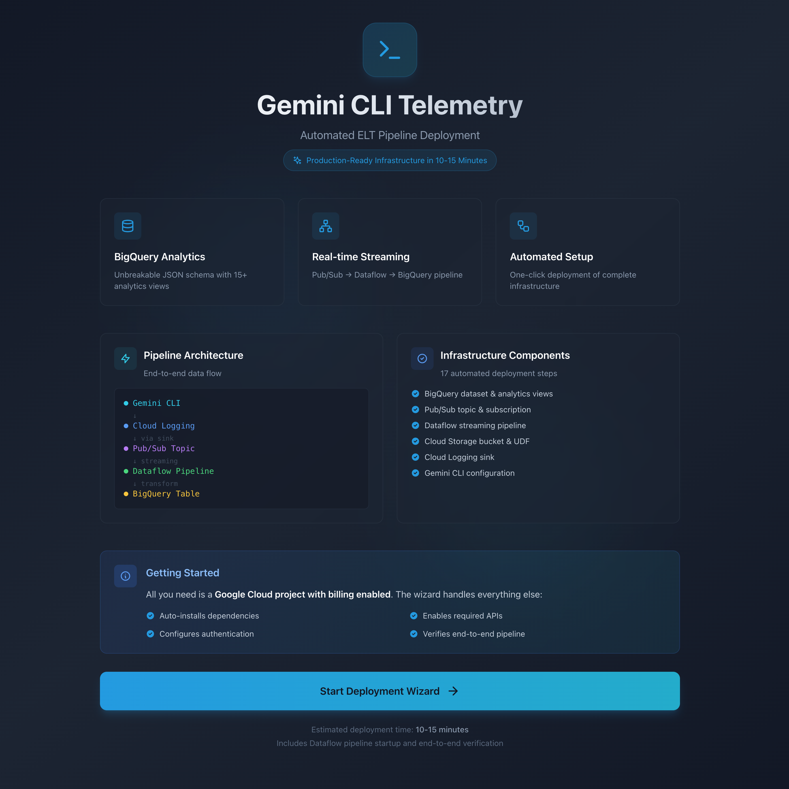
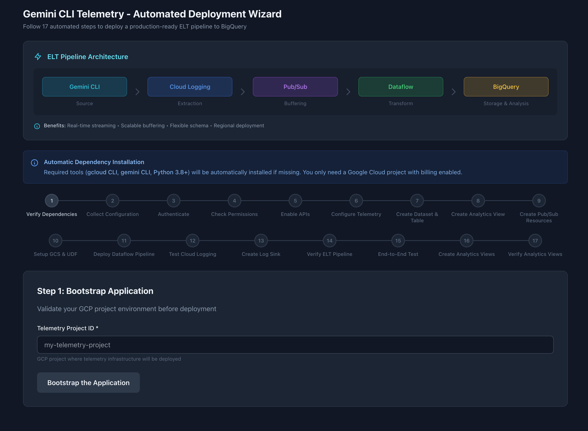

# Gemini CLI Telemetry - Automated Deployment Application

A production-ready local web application for deploying a complete ELT (Extract, Load, Transform) pipeline that captures Gemini CLI telemetry data and streams it to Google Cloud BigQuery for advanced analytics.





## Table of Contents

- [Overview](#overview)
- [ELT Pipeline Architecture](#elt-pipeline-architecture)
- [Key Features](#key-features)
- [Quick Start](#quick-start)
- [Architecture Deep Dive](#architecture-deep-dive)
- [BigQuery Schema](#bigquery-schema)
- [Analytics Views](#analytics-views)
- [Data Privacy & Pseudonymization](#data-privacy--pseudonymization)
- [Deployment Steps](#deployment-steps)
- [Configuration Options](#configuration-options)
- [Security](#security)
- [Development](#development)
- [Tech Stack](#tech-stack)
- [Troubleshooting](#troubleshooting)

---

## Overview

This application automates the deployment of a **real-time streaming telemetry pipeline** for the Gemini CLI. Instead of manually configuring multiple GCP services, you can deploy a complete, production-ready infrastructure in **10-15 minutes** through an intuitive wizard interface.

### What Gets Deployed

The wizard deploys and configures:

1. **BigQuery Infrastructure**
   - Dataset with regional configuration
   - Raw logs table with unbreakable JSON schema
   - 16 analytics views (13 regular views + 3 scheduled query tables)

2. **Streaming Pipeline**
   - Cloud Logging sink for log extraction
   - Pub/Sub topic and subscription for buffering
   - Dataflow streaming job for real-time transformation
   - GCS bucket with JavaScript UDF for data transformation

3. **Monitoring & Validation**
   - End-to-end pipeline verification
   - Data flow validation from CLI → BigQuery
   - Service account permissions and IAM roles

---

## ELT Pipeline Architecture

### High-Level Data Flow

```
┌─────────────┐    ┌──────────────┐    ┌─────────┐    ┌──────────┐    ┌──────────┐
│ Gemini CLI  │───▶│ Cloud Logging│───▶│ Pub/Sub │───▶│ Dataflow │───▶│ BigQuery │
│  (Source)   │    │ (Extraction) │    │(Buffering)   │(Transform)    │(Analytics)│
└─────────────┘    └──────────────┘    └─────────┘    └──────────┘    └──────────┘
```

### Component Roles

#### 1. **Gemini CLI** (Data Source)
- Generates telemetry events during AI interactions
- Logs structured data to Cloud Logging
- Configured via `~/.gemini/settings.json`
- Supports two authentication methods:
  - **OAuth**: Browser-based authentication (recommended for interactive use)
  - **Vertex AI**: Application Default Credentials with region configuration (for headless/automation)

#### 2. **Cloud Logging** (Extraction)
- **Purpose**: Central log aggregation service
- **Role**: Captures all Gemini CLI telemetry events
- **Log Filter**: `logName="projects/{project}/logs/gemini_cli"`
- **Why**: Provides reliable, managed log collection without client-side complexity

#### 3. **Log Sink** (Routing)
- **Purpose**: Routes logs from Cloud Logging to Pub/Sub
- **Configuration**:
  - Source: Cloud Logging
  - Destination: Pub/Sub topic `gemini-telemetry-topic`
  - Filter: Gemini CLI logs only (excludes diagnostic logs)
- **Why**: Enables asynchronous processing and decouples logging from analytics

#### 4. **Pub/Sub** (Buffering & Reliability)
- **Purpose**: Message queue for streaming data
- **Components**:
  - **Topic**: `gemini-telemetry-topic` (receives logs from sink)
  - **Subscription**: `gemini-telemetry-sub` (consumed by Dataflow)
- **Benefits**:
  - **Buffering**: Handles traffic spikes gracefully
  - **Reliability**: Messages retained for 7 days
  - **Scalability**: Auto-scales to handle any throughput
  - **Decoupling**: Sink and Dataflow can operate independently
- **Why**: Industry-standard pattern for streaming pipelines, provides resilience

#### 5. **Dataflow** (Transformation)
- **Purpose**: Real-time data transformation and loading
- **Template**: Google-managed `PubSub_Subscription_to_BigQuery`
- **Transformation**: JavaScript UDF (`transform.js`) extracts and structures data
- **Process**:
  1. Reads messages from Pub/Sub subscription
  2. Applies JavaScript transformation function
  3. Writes structured records to BigQuery
- **Benefits**:
  - **Serverless**: Auto-scales worker pools based on load
  - **Fault-tolerant**: Retries failed transformations
  - **Exactly-once**: Guarantees no data loss or duplication
- **Why**: Provides schema-on-read flexibility and handles complex JSON transformations

#### 6. **GCS Bucket** (UDF Storage)
- **Purpose**: Stores JavaScript transformation function
- **File**: `transform.js` (extracts fields from Cloud Logging JSON)
- **Why**: Dataflow template requires UDF hosted in GCS

#### 7. **BigQuery** (Storage & Analytics)
- **Purpose**: Data warehouse for long-term storage and analysis
- **Tables**:
  - `gemini_raw_logs`: Raw telemetry data (unbreakable JSON schema)
  - `gemini_analytics_view`: Flattened view for querying
  - 12 additional analytics views for specific use cases
  - 3 scheduled query tables for aggregated metrics
- **Why**: Optimized for analytical workloads, supports petabyte-scale data

---

### Why This Architecture?

#### Design Principles

1. **Schema-on-Read (Flexibility)**
   - Raw table stores JSON as STRING
   - Views apply schema transformation at query time
   - Benefits: No ingestion failures due to schema changes

2. **Separation of Concerns**
   - Each component has a single responsibility
   - Failure in one component doesn't break entire pipeline
   - Easy to troubleshoot and maintain

3. **Real-Time Processing**
   - End-to-end latency typically < 1 minute
   - No batch jobs or scheduled exports
   - Data available for querying immediately

4. **Scalability**
   - Each component auto-scales independently
   - Handles traffic spikes gracefully
   - Cost-efficient (pay only for what you use)

5. **Reliability**
   - Pub/Sub provides message durability
   - Dataflow handles retries and errors
   - BigQuery provides 99.99% SLA

---

## Key Features

### 17-Step Automated Deployment
- Bootstrap validation (5 steps)
- Infrastructure deployment (12 steps)
- End-to-end verification

### Dual Authentication Methods
- **OAuth** (Recommended): Browser-based authentication using Application Default Credentials
- **Vertex AI**: Uses existing ADC with Vertex AI API for headless environments
- Separate authentication for gcloud CLI and Gemini CLI
- Independent project and region configuration for Gemini API calls

### Single-Project & Cross-Project Support
- **Single-Project**: All infrastructure in one GCP project
- **Cross-Project**: Gemini CLI in one project, telemetry in another
- Automatic service account permission management

### Real-Time Progress Tracking
- Visual stepper showing current step
- Detailed status messages for each operation
- Error handling with recovery guidance

### Data Privacy Features
- **Pseudonymization**: Optional SHA256 hashing of user emails
- GDPR/CCPA compliance ready
- Configurable prompt logging

### Security Hardening
- Input validation for all GCP identifiers
- Prevents administrator mistakes (typos, invalid formats)
- Validates project IDs, regions, dataset names, etc.

---

## Quick Start

### Prerequisites

**Required:**
- Google Cloud project with billing enabled
- Modern web browser

**Optional** (automatically installed if missing):
- `gcloud` CLI
- `gemini` CLI
- Python 3.9+

### Installation & Startup

```bash
# Clone repository
git clone <repository-url>
cd app

# Automated setup (installs all dependencies)
./setup.sh

# Start the application
./run.sh
```

The app will be available at:
- **Frontend**: http://localhost:3000
- **Backend API**: http://localhost:8000

### Deploy Telemetry Infrastructure

1. Open http://localhost:3000
2. Click "Start Deployment Wizard"
3. **Bootstrap** (Step 1):
   - Enter telemetry project ID
   - Click "Bootstrap the Application"
   - Wait for validation (checks dependencies, APIs, VPC)
4. **Configure** (Step 2):
   - Choose single-project or cross-project setup
   - Select deployment region (default: us-central1)
   - Configure Gemini CLI authentication:
     - **OAuth** (Recommended): Browser-based authentication
     - **Vertex AI**: Headless mode with ADC (requires region selection)
   - Configure privacy options:
     - **Log Prompts**: Include user prompts in telemetry (default: OFF)
     - **Pseudonymization**: Hash user emails for privacy (default: OFF)
   - Select VPC network (optional)
5. **Deploy** (Steps 3-14):
   - Wizard runs 12 automated deployment steps
   - Watch real-time progress
   - Deployment typically completes in 10-15 minutes
6. **Verify**:
   - End-to-end test sends a test query through complete pipeline
   - View data in BigQuery console

---

## Architecture Deep Dive

### Application Structure

```
app/
├── frontend/                 # React + TypeScript web UI
│   ├── src/
│   │   ├── components/      # Reusable UI components
│   │   │   ├── ConfigForm.tsx          # Deployment configuration form
│   │   │   ├── DeploymentProgress.tsx   # Real-time progress display
│   │   │   └── WizardStepper.tsx        # Visual step indicator
│   │   ├── pages/
│   │   │   ├── HomePage.tsx             # Landing page
│   │   │   └── WizardPage.tsx           # Main deployment wizard
│   │   ├── services/
│   │   │   └── api.ts                   # Backend API client
│   │   └── types/
│   │       └── index.ts                 # TypeScript type definitions
│   └── package.json
└── backend/                  # Python FastAPI API server
    ├── services/            # Service modules (one per GCP service)
    │   ├── api_service.py              # GCP API enablement
    │   ├── auth_service.py              # OAuth & authentication
    │   ├── bigquery_service.py         # BigQuery dataset/table management
    │   ├── bigquery_views_service.py   # Analytics views creation
    │   ├── dataflow_service.py         # Dataflow pipeline deployment
    │   ├── gcs_service.py              # GCS bucket & UDF management
    │   ├── iam_service.py              # IAM permissions checking
    │   ├── logging_service.py          # Cloud Logging verification
    │   ├── pubsub_service.py           # Pub/Sub topic/subscription
    │   ├── sink_service.py             # Log sink creation
    │   ├── telemetry_service.py        # Gemini CLI configuration
    │   └── verification_service.py     # End-to-end testing
    ├── utils/
    │   └── validators.py               # Input validation utilities
    ├── main.py              # FastAPI application
    └── requirements.txt
```

### Backend Service Architecture

Each service is responsible for a specific GCP component:

- **Stateless**: No shared state between requests
- **Idempotent**: Safe to retry operations
- **Validated**: All inputs validated before use
- **Logged**: Comprehensive logging for troubleshooting

---

## BigQuery Schema

### Raw Logs Table: `gemini_raw_logs`

**Design Philosophy**: Unbreakable schema using JSON string storage for maximum flexibility.

#### Schema

| Column | Type | Description |
|--------|------|-------------|
| `insertId` | STRING | Unique log entry identifier |
| `timestamp` | TIMESTAMP | When the log was generated |
| `severity` | STRING | Log severity level (INFO, ERROR, etc.) |
| `logName` | STRING | Fully-qualified log name |
| `resource` | STRING | JSON string containing resource metadata |
| `httpRequest` | STRING | JSON string containing HTTP request details (if applicable) |
| `labels` | STRING | JSON string containing log labels/tags |
| `operation` | STRING | JSON string containing operation metadata |
| `trace` | STRING | Trace ID for distributed tracing |
| `spanId` | STRING | Span ID for distributed tracing |
| `traceSampled` | BOOLEAN | Whether the trace was sampled |
| `jsonPayload` | JSON | **Main telemetry data** (native JSON type in BigQuery) |

#### Why This Schema?

**Problem**: Traditional structured schemas break when Cloud Logging JSON format changes.

**Solution**: Store complex fields as STRING (JSON blobs):
- `resource`, `httpRequest`, `labels`, `operation` → STRING
- Only `jsonPayload` uses native JSON type

**Benefits**:
1. **Zero ingestion failures**: Schema changes in Cloud Logging don't break pipeline
2. **Schema-on-read**: Apply structure at query time via views
3. **Future-proof**: New fields automatically captured
4. **Performance**: Native JSON type for main payload enables efficient queries

---

### Analytics View: `gemini_analytics_view`

**Purpose**: Flattened, queryable view that extracts 30+ fields from raw JSON.

#### Key Fields Extracted

**User & Session**:
- `user_email` or `user_email_hash`: User identifier (pseudonymized if enabled)
- `session_id`: Gemini CLI session identifier
- `request_id`: Unique request identifier

**Model & Configuration**:
- `model`: Model used (e.g., gemini-1.5-pro)
- `tool`: Tool/command executed
- `temperature`: Model temperature setting
- `top_k`, `top_p`: Sampling parameters

**Performance Metrics**:
- `input_tokens`: Tokens in user prompt
- `output_tokens`: Tokens in model response
- `total_tokens`: Combined token count
- `duration_ms`: Request duration in milliseconds
- `first_token_ms`: Time to first token

**Content** (if `log_prompts` enabled):
- `user_prompt`: Original user query
- `response_text`: Model's response

**Error Tracking**:
- `error_message`: Error description (if request failed)
- `error_code`: Error code
- `status`: Request status (success/failure)

**Metadata**:
- `project_id`: GCP project where CLI ran
- `region`: GCP region
- `cli_version`: Gemini CLI version
- `platform`: Operating system

---

## Analytics Views

The application creates **16 analytics views** to answer common business questions. Full SQL queries are available in `bq-queries.md`.

### View Summary

| # | View Name | Type | Description |
|---|-----------|------|-------------|
| 1 | `daily_metrics` | View | Aggregates key metrics on a daily basis for each model. Designed for high-level dashboards in Looker Studio. Queries on-demand for real-time data. |
| 2 | `vw_user_activity` | View | Aggregates usage metrics by user, providing insights into user adoption and engagement. Helps identify power users, inactive users, and overall user activity patterns. |
| 3 | `vw_token_usage` | Materialized View | Provides detailed analysis of token consumption, breaking down input, output, and cached tokens by day, user, and model. Useful for understanding cost drivers and model efficiency. Refreshes every 60 minutes. |
| 4 | `vw_tool_performance` | View | Provides insights into the performance and usage patterns of various tools invoked by the Gemini CLI. Tracks total calls, success/failure rates, and average execution durations for each tool. |
| 5 | `vw_quota_tracking` | View | Provides minute-level aggregation of model requests and token usage per user and model. Designed to support monitoring against official Gemini CLI quotas (Requests Per Minute and Requests Per Day per user). |
| 6 | `vw_error_analysis` | View | Provides a consolidated look at errors, breaking them down by day, CLI version, model, error code, and message. Helps identify common issues, track error frequencies, and pinpoint if errors correlate with specific CLI releases. |
| 7 | `daily_rollup_table` | Scheduled Query (Table) | Processes the previous day's telemetry data and aggregates key metrics into a partitioned table. Serves as a highly optimized source for daily reporting and historical analysis. Partitioned by `day`, clustered by `model`. |
| 8 | `weekly_rollup_table` | Scheduled Query (Table) | Processes the previous week's telemetry data and aggregates key metrics into a partitioned table. Provides highly optimized source for weekly reporting and trend analysis. Partitioned by `week_start_date`, clustered by `model`. |
| 9 | `quota_alerts_table` | Scheduled Query (Table) | Identifies users who have exceeded predefined Requests Per Minute (RPM) or Requests Per Day (RPD) thresholds. Results stored in table for triggering notifications or further investigation. Partitioned by `alert_date`, clustered by `user_email`, `alert_type`. |
| 10 | `vw_cli_performance_and_resilience` | View | Monitors the operational health and resilience of the CLI by tracking fallback events, content retries, and the effectiveness of chat compression. Helps answer questions about CLI stability and efficiency. |
| 11 | `vw_model_routing_analysis` | View | Provides insights into the behavior and performance of the model router. Analyzes which models are being chosen, the sources influencing those decisions, and the associated latency and failure rates. |
| 12 | `vw_malformed_json_responses` | Materialized View | Specifically tracks failures of the `generateJson` command by counting `gemini_cli.malformed_json_response` events. Helps identify if certain models or users are more prone to receiving non-parsable JSON. Refreshes every 60 minutes. |
| 13 | `vw_feature_adoption` | Materialized View | Tracks the adoption of key features like slash commands, agent mode, and extensions. Provides daily breakdown of feature usage by user and CLI version, helping identify power users and measure impact of new releases. Refreshes every 60 minutes. |
| 14 | `vw_user_configuration` | View | Captures the latest known configuration for each user based on the `gemini_cli.config` event logged at startup. Useful for understanding how users customize their environment, which can inform default settings and documentation priorities. |
| 15 | `vw_conversation_analysis` | Materialized View | Analyzes chat sessions using the `gemini_cli.conversation_finished` event. Provides metrics on conversation length (turn count) and how they vary by user, CLI version, and approval mode. Useful for understanding user engagement and interaction patterns. Refreshes every 60 minutes. |

### View Categories

**Regular Views** (query raw data on-demand):
- `daily_metrics`, `vw_user_activity`, `vw_error_analysis`, `vw_tool_performance`
- `vw_cli_performance_and_resilience`, `vw_model_routing_analysis`
- `vw_quota_tracking`, `vw_user_configuration`

**Materialized Views** (auto-refresh every 60 minutes):
- `vw_token_usage`, `vw_malformed_json_responses`, `vw_feature_adoption`, `vw_conversation_analysis`

**Scheduled Query Tables** (require manual scheduling in BigQuery):
- `daily_rollup_table` - Daily at 2 AM (90-day retention)
- `quota_alerts_table` - Hourly (30-day retention)
- `weekly_rollup_table` - Weekly on Sunday at 3 AM (52-week retention)

---

## 429 Error Tracking & AI Analysis

### Overview

The application includes advanced rate limit monitoring and AI-powered error analysis to help you understand and prevent quota exhaustion.

### Features

#### 1. Enhanced Quota Tracking (`vw_quota_tracking`)

The quota tracking view now includes comprehensive 429 error monitoring:

**New Fields**:
- `hour` - Hourly timestamp for aggregation
- `error_429_count_per_minute` - Count of 429 errors per minute
- `error_429_count_per_hour` - Hourly 429 error count
- `error_429_count_per_day` - Daily 429 error count
- `total_errors_per_minute` - All HTTP errors per minute

**Usage Example**:
```sql
SELECT
  DATE(minute) as day,
  SUM(error_429_count_per_day) as total_429_errors,
  SUM(requests_per_day) as total_requests
FROM `project.dataset.vw_quota_tracking`
WHERE DATE(minute) >= DATE_SUB(CURRENT_DATE(), INTERVAL 7 DAY)
GROUP BY day
ORDER BY day DESC
```

#### 2. AI-Powered Error Analysis (`vw_429_error_summary`)

Gemini analyzes your 429 errors and provides actionable insights.

**Query Example**:
```sql
SELECT
  total_429_errors,
  oldest_error,
  newest_error,
  error_summary
FROM `project.dataset.vw_429_error_summary`
```

### Vertex AI Setup

The AI-powered error analysis requires Vertex AI integration.

#### Prerequisites

1. **Enable Vertex AI API**:
```bash
gcloud services enable aiplatform.googleapis.com --project=YOUR_PROJECT_ID
```

2. **IAM Permissions**:
   - `bigquery.connections.create` - Create Vertex AI connection
   - `iam.serviceAccounts.actAs` - Grant permissions to service accounts
   - `aiplatform.endpoints.predict` - Use Vertex AI models

#### Automated Setup (New Deployments)

For new deployments, Vertex AI setup is included in Step 19 of the deployment wizard (Create Analytics Views):
- Creates BigQuery connection to Vertex AI
- Grants necessary IAM permissions
- Creates remote Gemini model (`gemini_flash_model`)

#### Manual Setup (Existing Deployments)

For existing deployments, run the migration script:

```bash
# From project root directory
python add_429_tracking.py \
  --project YOUR_PROJECT_ID \
  --dataset YOUR_DATASET_NAME
```

See `ADD_429_TRACKING_README.md` for detailed migration instructions.

### Cost Considerations

**BigQuery Costs**:
- Views are free (no storage cost)
- Standard query pricing applies

**ML.GENERATE_TEXT Costs**:
- Pricing: ~$0.000125 per 1,000 characters
- Cost per query to `vw_429_error_summary`: ~$0.006
- On-demand only (costs only when queried)
- Estimated monthly cost (queried once/day): ~$0.18

---

## Data Privacy & Pseudonymization

### What is Pseudonymization?

**Pseudonymization** is a data privacy technique that replaces personally identifiable information (PII) with artificial identifiers (pseudonyms).

### How It Works

When **pseudonymization is enabled**:

1. **Email Hashing**: User emails are hashed using SHA256
   ```
   Original: user@example.com
   Pseudonymized: b4c9a9a2e3f8a0d1c2b3e4f5a6b7c8d9...
   ```

2. **One-Way Transformation**: Cannot reverse hash to get original email
3. **Consistent Hashing**: Same email always produces same hash
4. **View Creation**: Analytics views use `user_email_hash` column instead of `user_email`

### Benefits

- **GDPR Compliance**: Reduces regulatory risk for EU users
- **CCPA Compliance**: Supports California privacy law requirements
- **Privacy-Preserving Analytics**: Can still track user behavior without knowing identity
- **Data Retention**: Safer to retain data for longer periods

### Trade-Offs

| With Pseudonymization | Without Pseudonymization |
|---|---|
| ✅ GDPR/CCPA compliant | ❌ PII stored in plaintext |
| ✅ Lower privacy risk | ❌ Higher regulatory risk |
| ❌ Cannot identify specific users | ✅ Can identify users by email |
| ❌ Cannot contact users directly | ✅ Can reach out to users |

### When to Use

**Enable pseudonymization if:**
- You have EU users (GDPR applies)
- You have California users (CCPA applies)
- You want to minimize privacy risk
- You don't need to identify specific users

**Disable pseudonymization if:**
- You need to contact users based on telemetry
- You need to correlate telemetry with user accounts
- Your organization has approved PII storage policies

---

## Deployment Steps

The wizard executes 17 steps split into 2 phases:

### Phase 1: Bootstrap (5 Steps)

1. **Verify Dependencies** - Check gcloud, gemini, Python
2. **Authenticate** - GCP authentication
3. **Check Compute API** - Verify Compute Engine enabled
4. **Enable Required APIs** - Auto-enable 11 GCP APIs
5. **Check VPC Networks** - Verify landing zone configured

### Phase 2: Deployment (12 Steps)

6. **Collect Configuration** - Project, dataset, and authentication settings
7. **Check Permissions** - Verify IAM roles (90s IAM propagation delay)
8. **Enable APIs** - Verify all required APIs are accessible
9. **Configure Telemetry** - Update Gemini CLI settings.json with authentication method (OAuth or Vertex AI) and environment variables
10. **Create Dataset & Table** - BigQuery raw table with JSON schema
11. **Create Analytics View** - Base flattened view for querying
12. **Create Pub/Sub Resources** - Topic and subscription for ELT
13. **Setup GCS & UDF** - Bucket and transform function
14. **Deploy Dataflow Pipeline** - Start streaming job (2-3 minutes for worker startup)
15. **Test Cloud Logging** - Verify logs appear
16. **Create Log Sink** - Sink to Pub/Sub topic
17. **Verify ELT Pipeline** - Check complete pipeline
18. **End-to-End Test** - Verify complete data flow (10-15 minutes for first data)
19. **Create Analytics Views** - 16 views for analysis (includes Vertex AI setup for AI-powered error analysis)
20. **Verify Analytics Views** - Confirm all views created

---

## Configuration Options

### Project Configuration

**Single-Project Setup** (Recommended for simplicity):
- Telemetry Project: `my-telemetry-project`
- Gemini CLI Project: `my-telemetry-project` (same)

**Cross-Project Setup** (Recommended for security):
- Telemetry Project: `my-telemetry-project` (data warehouse)
- Gemini CLI Project: `my-production-project` (where CLI runs)

### Authentication Methods

The application supports two authentication methods for Gemini CLI:

**OAuth** (Default - Recommended):
- Browser-based authentication with Google
- Uses Application Default Credentials (ADC)
- Works in interactive environments
- Automatic credential refresh
- Best for: Development environments, personal use

**Vertex AI**:
- Uses existing Application Default Credentials
- Requires `GOOGLE_CLOUD_LOCATION` environment variable
- Works in headless/non-interactive environments
- Requires separate region configuration for Gemini API
- Best for: CI/CD pipelines, server environments, automation

**Configuration Details**:
- Authentication method selection appears after region configuration
- For Vertex AI, you must specify the Gemini API region
- Gemini API region can differ from deployment infrastructure region
- Settings are written to `~/.gemini/settings.json` and shell profile

### Region Selection

**Deployment Region**:
Choose a region close to your users for infrastructure:
- `us-central1` (Iowa) - Default, lowest cost
- `us-east1` (South Carolina)
- `us-west1` (Oregon)
- `europe-west1` (Belgium)
- `asia-east1` (Taiwan)

**Gemini API Region** (Vertex AI only):
Select the region for Gemini API calls:
- Can be same as deployment region or different
- Auto-filled with deployment region by default
- Supported regions: `us-central1`, `us-east1`, `us-west1`, `europe-west1`, `asia-northeast1`, etc.

### Privacy Options

**Log Prompts** (Default: OFF):
- **OFF**: Only metadata logged (tokens, duration, model, etc.)
- **ON**: User prompts and responses included in telemetry

**Pseudonymization** (Default: OFF):
- **OFF**: User emails stored in plaintext
- **ON**: User emails hashed with SHA256

### Network Configuration

**Default Network** (Recommended):
- Uses project's default VPC
- No additional setup required

**Custom VPC**:
- Select custom VPC network
- Select subnetwork
- Firewall rules automatically created

---

## Security

### Security Improvements Applied

This application has been hardened with comprehensive security improvements appropriate for a local admin tool:

#### Input Validation (✅ Complete)
- All GCP identifiers validated before use
- Prevents typos and malformed input
- Validates: project IDs, dataset names, regions, networks, buckets, topics, tables
- Helpful error messages guide administrators

#### Validation Rules
- **Project ID**: 6-30 chars, lowercase, starts with letter, only letters/digits/hyphens
- **Dataset**: Letters, digits, underscores only (1-1024 chars)
- **Region**: Format like `us-central1`, `europe-west1`
- **Network**: RFC 1035 compliant (lowercase, 1-63 chars)

See `backend/SECURITY_ASSESSMENT.md` for full details.

### IAM Permissions Required

The user running this tool needs:

**Minimal Required Roles**:
- `roles/bigquery.dataEditor` - Create datasets and tables
- `roles/bigquery.jobUser` - Run BigQuery queries
- `roles/logging.configWriter` - Create log sinks
- `roles/logging.privateLogViewer` - Read logs for verification
- `roles/dataflow.developer` - Deploy Dataflow jobs
- `roles/storage.objectCreator` - Create GCS buckets
- `roles/pubsub.editor` - Create Pub/Sub topics
- `roles/iam.serviceAccountUser` - Use service accounts

**Alternative**:
- `roles/editor` or `roles/owner` (has all above permissions)

---

## Development

### Frontend Development

```bash
cd frontend
npm install
npm run dev      # Development server with hot reload
npm run build    # Production build
npm run preview  # Preview production build
```

**Stack**:
- React 18 with TypeScript
- Vite for build tooling
- Tailwind CSS for styling
- React Router for navigation
- Axios for API calls

### Backend Development

```bash
cd backend
python -m venv venv
source venv/bin/activate  # On Windows: venv\Scripts\activate
pip install -r requirements.txt
python main.py
```

**Stack**:
- FastAPI for REST API
- Python 3.9+
- Google Cloud SDK
- Uvicorn ASGI server

### Running Tests

```bash
# Backend tests
cd backend
source venv/bin/activate
pytest tests/

# Integration tests
python test_e2e_steps_15_17.py
```

---

## Tech Stack

### Frontend
- **React** 18.2 - UI framework
- **TypeScript** 5.2 - Type safety
- **Vite** 5.0 - Build tool
- **Tailwind CSS** 3.3 - Styling
- **React Router** 6.20 - Navigation
- **Axios** 1.6 - HTTP client
- **Lucide React** - Icons

### Backend
- **Python** 3.9+
- **FastAPI** 0.104 - REST API framework
- **Uvicorn** - ASGI server
- **Google Cloud Libraries**:
  - `google-cloud-bigquery` - BigQuery operations
  - `google-cloud-logging` - Cloud Logging
  - `google-cloud-pubsub` - Pub/Sub management
  - `google-cloud-storage` - GCS operations
  - `google-cloud-dataflow` - Dataflow deployment
- **Pydantic** - Data validation

---

## Troubleshooting

### Common Issues

#### 1. "API not enabled" errors

**Solution**: Use the wizard's "Enable APIs" step, or manually:
```bash
gcloud services enable \
  bigquery.googleapis.com \
  logging.googleapis.com \
  dataflow.googleapis.com \
  storage.googleapis.com \
  pubsub.googleapis.com \
  compute.googleapis.com
```

#### 2. "Permission denied" errors

**Solution**: Verify IAM permissions:
```bash
gcloud projects get-iam-policy YOUR-PROJECT-ID \
  --flatten="bindings[].members" \
  --filter="bindings.members:user:YOUR-EMAIL"
```

#### 3. Dataflow job fails to start

**Possible causes**:
- VPC network not found
- Insufficient compute quotas
- Service account permissions missing

**Solution**: Check Dataflow job logs in Cloud Console

#### 4. No data appearing in BigQuery

**Check**:
1. Dataflow job is running: Cloud Console → Dataflow
2. Pub/Sub has messages: Cloud Console → Pub/Sub → Topics
3. Log sink exists: Cloud Console → Logging → Log Router
4. Run test query: `gemini "What is 2+2?"`

#### 5. "Invalid project ID" error

**Cause**: Input validation detected invalid format

**Solution**: Ensure project ID:
- Is 6-30 characters
- Starts with lowercase letter
- Contains only lowercase letters, digits, hyphens

#### 6. Vertex AI authentication fails in headless mode

**Cause**: Missing `GOOGLE_CLOUD_LOCATION` environment variable

**Solution**:
1. Verify `~/.gemini/settings.json` contains `GOOGLE_CLOUD_LOCATION` in `env` section
2. Check shell profile (`~/.bashrc` or `~/.zshrc`) has `export GOOGLE_CLOUD_LOCATION="<region>"`
3. Source your shell profile: `source ~/.bashrc` or `source ~/.zshrc`
4. Verify environment variable: `echo $GOOGLE_CLOUD_LOCATION`

#### 7. Cross-project OAuth authentication not working

**Cause**: Authentication required for separate Gemini CLI project

**Solution**:
1. In the Configuration step, click "Authenticate Gemini CLI Project" button
2. Complete OAuth flow in browser window
3. Verify authentication successful before continuing deployment

---

## Additional Documentation

- **Security Assessment**: `backend/SECURITY_ASSESSMENT.md`
- **Security Improvements**: `backend/SECURITY_IMPROVEMENTS_APPLIED.md`
- **Cross-Project Verification**: `backend/VERIFICATION_COMPLETE.md`
- **Frontend API Analysis**: `backend/FRONTEND_ANALYSIS.md`

---

## License

This project is licensed under the MIT License - see the [LICENSE](LICENSE) file for details.

The MIT License is a permissive license that allows:
- ✅ Commercial use
- ✅ Modification
- ✅ Distribution
- ✅ Private use

---

## Support

For issues and questions:
1. Check this README and troubleshooting section
2. Review security documentation in `backend/`
3. Check Cloud Console logs for specific error messages
4. Verify IAM permissions and API enablement
